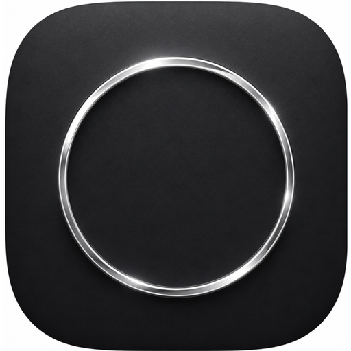

# zebBrowser 🦓

A minimal, fast, frameless browser — *just a centered pill and the web*. Built with **Tauri 2 + React + Rust** for low RAM, native feel, and easy extensibility. No tabs, no bookmarks, no history — content gets the full window.



> Inspired by Zeb / Arc — spotlight search, hover-reveal URL bar, and auto-updates.

---

## ✨ Features

- **Spotlight search** — `Enter URL or search...` centered pill (`640px`, `12px` radius, soft shadow) on `about:blank`. `DuckDuckGo` fallback if input has no `.`/`://`/`localhost`.
- **Hover Zeb bar** — tiny `28px` top strip (`#ececec`) with `title-pill` + `URL pill` (`#e8e8e8` → `#fff` on focus). Hidden by default (`translateY(-100%)`), peeks on hover `y<20px` or `8px` handle (so it doesn't fight your Waybar/Hyprland top bar). Hides on `y>56` or `Esc`.
- **Frameless** — `decorations:false` `transparent:false` `shadow:true` `10px` rounded, `1200×800` (min `800×500`), no OS title bar.
- **Auto-close** — after `Enter` both pills blur + hide, web fills window.
- **Same-page links** — `a[target="_blank"]→_self` + `window.open` patch, `sandbox="allow-top-navigation"` — links stay in the same view.
- **Shortcuts (global + in-page)** — `Ctrl/Cmd+L` focus URL, `Ctrl/Cmd+R` / `F5` reload, `Alt←` back, `Alt→` forward, `Esc` hide. Works even when the site `iframe` has focus via `postMessage` forwarding + `tauri-plugin-global-shortcut`.
- **RAM-efficient** — Tauri WebView (system WebKitGTK on Linux), `iframe` with `referrerPolicy` + `allow` permissions, no page cache bloat.
- **Auto-updater** — `tauri-plugin-updater` + `process` with `latest.json` from GitHub Releases. Popup on push: `Update available vX` → `Update & relaunch`. `check()` on mount + every 30m.
- **Branding** — `public/logo.png` (`512` web) + `src-tauri/icons/*` generated via `magick` (`32`–`512`, `ico`/`icns`).

---

## 🧱 Tech Stack

- **Frontend:** React 19 + TypeScript + Vite 7
- **Backend:** Rust + Tauri 2 (`tauri-plugin-opener`, `global-shortcut`, `updater`, `process`)
- **WebView:** `webkit2gtk-4.1` (Linux), `WebKit` (macOS), `WebView2` (Windows)
- **Package:** `pnpm` + `cargo`

---

## 📥 Install (any arch, any distro — curl handles deps)

**One-liner (detects `x86_64`/`aarch64` + `apt`/`dnf`/`pacman`/`zypper`, installs `webkit2gtk-4.1` etc.):**
```sh
curl -fsSL https://raw.githubusercontent.com/sahilcodexx/zebBrowser/main/install.sh | bash
# → installs deb on Ubuntu/Debian, rpm on Fedora, AppImage fallback on others
# then run: zeb  or  ~/.local/bin/zeb
```

**Arch AUR:**
```sh
# PKGBUILD is in repo root — publish to AUR or build locally:
makepkg -si  # or  yay -S zeb-browser / paru -S zeb-browser  (once AUR published)
# or
sudo pacman -U zeb-browser-*.pkg.tar.zst
```

**Manual (AppImage universal):**
```sh
# from GitHub Releases → zeb_0.1.0_amd64.AppImage
chmod +x zeb_*_amd64.AppImage && ./zeb_*_amd64.AppImage
```

---

## 🚀 Quick Start (dev)

```sh
# clone
git clone https://github.com/sahilcodexx/zebBrowser.git
cd zebBrowser

# install
pnpm install

# dev (Vite only)
pnpm dev              # http://localhost:1420

# dev (full Tauri window)
pnpm tauri dev

# build (Vite + Tauri)
pnpm build            # → dist/
pnpm tauri build      # → src-tauri/target/release/bundle/
```

### Linux deps (Arch)

```sh
sudo pacman -S webkit2gtk-4.1 gtk3 libappindicator-gtk3 librsvg base-devel
```

---

## ⌨️ Shortcuts

| Shortcut | Action |
|---|---|
| `Ctrl/Cmd + L` | Focus URL (center if blank, top Zeb bar if browsing) |
| `Ctrl/Cmd + R` / `F5` | Reload page (iframe) |
| `Alt + ←` / `Alt + →` | Back / Forward |
| `Esc` | Hide bars, blur |
| `Enter` in pill | Navigate (`https://` auto-added, else DuckDuckGo) |

Hover the top `8px` handle to peek the Zeb bar.

---

## 🔄 Auto-Updater

- **Config:** `src-tauri/tauri.conf.json` `plugins.updater.pubkey` + `endpoints: ["https://github.com/sahilcodexx/zebBrowser/releases/latest/download/latest.json"]` + `bundle.createUpdaterArtifacts:true`
- **Keypair:** `~/.tauri/zeb.key` (private, keep secret) / `~/.tauri/zeb.key.pub` (public in config). Generated via `pnpm tauri signer generate --write-keys ~/.tauri/zeb.key`
- **Release:** bump `version` in `tauri.conf.json` + `package.json`, then

```sh
git tag v0.1.1 && git push origin v0.1.1
# GitHub Actions .github/workflows/release.yml builds AppImage/deb/msi/dmg + latest.json (draft) → Publish
```

App checks on mount + every 30m via `check()` `src/App.tsx:22` and shows `Update available` popup → `downloadAndInstall()` → `relaunch()`.

**Setup GitHub secret:** `TAURI_SIGNING_PRIVATE_KEY` = contents of `~/.tauri/zeb.key`, `TAURI_SIGNING_PRIVATE_KEY_PASSWORD` = (empty, no password).

---

## 🗂️ Structure

```
mini/  # → zebBrowser
├── public/logo.png           # 512 web favicon (6.3M 3200 backup at logo-3200.png)
├── src/
│   ├── App.tsx               # centered pill + hover Zeb bar + iframe + shortcuts + updater
│   └── App.css               # 10px rounded, shadows, transitions
├── src-tauri/
│   ├── tauri.conf.json       # windows 1200×800 frameless, updater, bundle icons
│   ├── Cargo.toml            # tauri 2 + opener + global-shortcut + updater + process
│   ├── src/lib.rs            # global shortcuts (Ctrl+L/R, F5, Alt←→, Esc) → emit
│   └── icons/*               # generated from logo.png via magick
├── .github/workflows/release.yml
└── dist/                     # vite build (gitignored)
```

---

## 🧩 Adding Features

- **New shortcut:** add `Shortcut::new` in `src-tauri/src/lib.rs` + `listen` in `src/App.tsx`
- **New page:** extend `makeUri` or add `invoke` command in `lib.rs`
- **Theming:** tweak `App.css` `:root --bg` and `#ececec` / `#e8e8e8` pills

---

## 📦 Build Artifacts

- `pnpm tauri build` → `src-tauri/target/release/bundle/appimage/deb/rpm/msi/dmg` + `latest.json` for updater.

---

## 📄 License

MIT — do what you want, keep the pill floating.

> Built for a single Linux desktop, but runs on macOS/Windows via Tauri.
